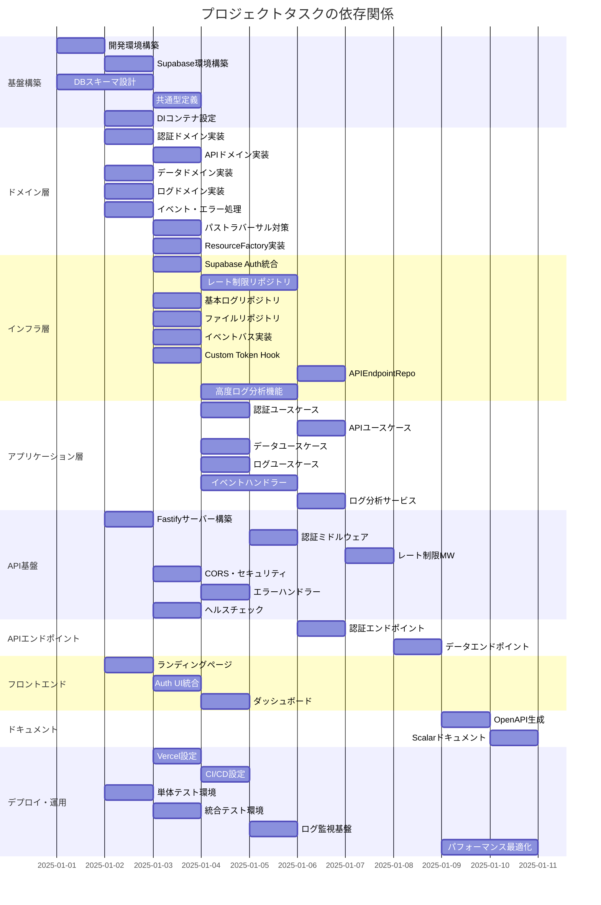

# タスク間依存関係

本ドキュメントでは、各タスク間の依存関係をガントチャート形式で可視化します。タスクは機能領域ごとにグループ化され、並行実行可能な作業と順次実行が必要な作業を明確に示しています。

## 依存関係の説明

### 基盤構築フェーズ
- **タスク0001**（開発環境構築）は全ての作業の前提条件
- **タスク0002**（Supabase環境）は認証・データベース関連の前提条件
- **タスク0034**（DBスキーマ設計）は最初に実行し、DB関連タスクの基盤となる
- **タスク0035**（共通型定義）は全パッケージで使用する型の基盤
- **タスク0038**（DIコンテナ設定）は依存性注入の基盤として早期に実装

### ドメイン層フェーズ
- ドメイン層の各コンテキスト（認証、API、データ、ログ）は並行開発可能
- **タスク0007**（イベント・エラー処理）は全ドメインで共通使用
- **タスク0039**（パストラバーサル対策）はセキュリティの重要実装
- **タスク0043**（ResourceFactory）はデータリソース生成の基盤

### インフラ層フェーズ
- 各リポジトリ実装は対応するドメイン層の完成が前提
- **タスク0009**（レート制限リポジトリ）と**タスク0010**（基本ログリポジトリ）は分離して実装
- **タスク0012**（イベントバス）はイベント処理基盤として必要
- **タスク0040**（Custom Token Hook）はJWTにtier情報を自動追加
- **タスク0041**（APIEndpointRepo）はエンドポイント設定管理
- **タスク0042**（高度ログ分析機能）は統計分析・異常検出を実装

### アプリケーション層フェーズ
- 各ユースケースは対応するドメイン層とインフラ層の完成が前提
- **タスク0014**（APIユースケース）は**タスク0013**（認証ユースケース）に依存
- イベントバスの完成も必須
- **タスク0044**（イベントハンドラー）は各種イベントの処理を実装
- **タスク0045**（ログ分析サービス）は不審なアクティビティを検出

### API実装フェーズ
- **タスク0017**（Fastifyサーバー）はAPI関連の基盤
- **タスク0036**（エラーハンドラー）はRFC 7807準拠の統一エラー処理を提供
- **タスク0037**（ヘルスチェック）は運用監視の基盤
- ミドルウェアは順次実装（認証→レート制限）
- エンドポイントは対応するユースケースの完成が前提

### フロントエンドフェーズ
- Webアプリケーションは独立して並行開発可能
- Auth UI統合はSupabase環境が前提

### 最終フェーズ
- ドキュメント生成はAPI実装完了後
- デプロイ設定は基本実装完了後
- テスト環境は早期に構築し、各実装と並行してテスト作成
- **タスク0032**（ログ監視基盤）は**タスク0016**（ログユースケース）完了後に実装